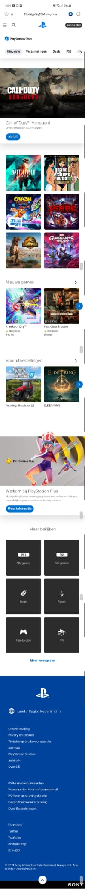
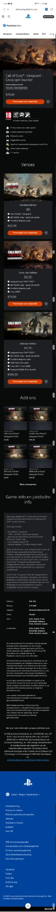

# Procesverslag
Naam: Jarreau Gill

Markdown is een simpele manier om HTML te schrijven.  
Markdown cheat cheet: [Hulp bij het schrijven van Markdown](https://github.com/adam-p/markdown-here/wiki/Markdown-Cheatsheet).

Nb. De standaardstructuur en de spartaanse opmaak van de README.md zijn helemaal prima. Het gaat om de inhoud van je procesverslag. Besteedt de tijd voor pracht en praal aan je website.

Nb. Door *open* toe te voegen aan een *details* element kun je deze standaard open zetten. Fijn om dat steeds voor de relevante stuk(ken) te doen.

## Jij

uitwerken voor kick-off werkgroep

### Auteur:
Jarreau Gill 

#### Je startniveau:
startniveau: ik ben blauw.

#### Je focus:
surefaceplane.
 

## Je website

uitwerken voor kick-off werkgroep

### Je opdracht:
https://store.playstation.com/nl-nl/pages/latest

#### Screenshot(s) van de eerste pagina (small screen): 
Homepage 

#### Screenshot(s) van de tweede pagina (small screen):
Productpage  

 

## Breakdownschets (week 1)

uitwerken na afloop 2e werkgroep

### de hele pagina: 

### dynamisch deel (bijv menu): 

### wellicht nog een dynamisch deel (bijv filter): 

## Voortgang 1 (week 2)

uitwerken voor 1e voortgang

### Stand van zaken
week 1 en week 2

Ik heb de laatste paar weken ge werkt aan mijn html en css van de website.
ik probeer nu te focussen om mijn html en css mooier te maken en ok een begin maken aan javascript.
met javascript wil ik een hamburger menu maken en nog andere dingen animren of laten bewegen.
op de twee de pagina is er veel te doen met javascript.

ik heb foto's van de website zelf gebruikt dus dat moet ik nog gaan opschrijven.

Wat ik nog aan moet werken is de class en id vervangen met de nth-child en andere selectoren.

## Voortgang 2 (week 3)

uitwerken voor 2e voortgang

### Stand van zaken
Deze week heb ik aan de productpagina gewerkt en het namaken van de pagina om alles op dezelfde manier te maken.
ik heb ook de css aangepast om de pagina vorm te geven.

Ik moet aangeven welek bronnen ik heb gebruikt voor de website zoals foto's enz.

Voor de rest heb ik niks gedaan met de webiste.

## Voortgang 3 (week 5)

uitwerken voor 3e voortgang

### Stand van zaken
De week voor de vakantie heb ik niet echt aan de website gewerkt.
In de vakantie heb ik niet echt aan de website gewrkt.
Ik heb wel door middel van volgen van een youtube video de hamburger menu kunnen maken ik zal de bron toevoegen tot mijn bronnen lijst.

## Voortgang 3 (week 7)

uitwerken voor 3e voortgang

### Stand van zaken
Tijdens de voortgangs gesprek met de docent hebben wij een paar afspraken gemaakt wat er verbeterd moet in de code en wat er nog erbij moet.
Ik moet nog op de surfaceplane werken en 5 states toepassen aan mijn webiste.
Boven dit moet ik nog kleine dingen aan mijn website aanpassen, zoals:
[Monday 4:38 PM] Danny de Vries
    
.Section uit footer
    
.Pixels hier en daar weglaten in css

.Classje weghalen en iets met nth-child doen

.Huisstijl van playstation store iets meer terug laten komen, lettertypes

Ik verder een paar animaties voor de surfaceplaen toegevoegd.
zoals een animatie dat laat een paar van de foto's shaken als je er overheen hovert.

ik heb ook een scroll optie toegevoegd dat als je scrollt verschijnt er een back to top buttun dat het makkelijker maakt om helemaal boven aan de website weer te komen.

Ik heb ook bij de html de scroll-behavior aangepast zodat het smooth gaat en niet te snel.

Ik heb op de homepagina een audio file toegevoegd dat de playstation slogan speelt.
Ik heb ook de hover element op sommige buttons toegepast.

## Eindgesprek (week 8)

uitwerken voor eindgesprek

### Stand van zaken
hier dit ging goed & dit was lastig (neem ook screenshots op van delen van je website en code)

### Screenshot(s)

hier screenshot(s) van je eindresultaat

## Bronnenlijst

continu bijhouden terwijl je werkt

Nb. Wees specifiek ('css-tricks' als bron is bijv. niet specifiek genoeg).

Ik heb onder ander deze plaatjes gebruikt in mijn website.
1. https://image.api.playstation.com/grc/images/ratings/hd/pegi/16.png?w=94&thumb=false
2. https://image.api.playstation.com/grc/images/descriptors/hd/pegi/ingamepurchases.png?w=94&thumb=false
3. https://image.api.playstation.com/grc/images/descriptors/hd/pegi/language.png?w=94&thumb=false
4. https://image.api.playstation.com/grc/images/descriptors/hd/pegi/violence.png?w=94&thumb=false
5. https://image.api.playstation.com/vulcan/img/rnd/202111/0819/JXC0Pg7tAtNl4Q2H3hUNOcTL.png?w=1920&thumb=false
6. https://image.api.playstation.com/vulcan/img/rnd/202111/0818/vR4da4gGjXIxqrtwJS5JlKYG.jpg?w=620&thumb=false
7. https://image.api.playstation.com/vulcan/img/rnd/202111/0818/slgE4eYJDXsprxobbOXUkden.jpg?w=620&thumb=false
8. https://image.api.playstation.com/vulcan/img/rnd/202111/0818/hlUq6DSeYQrwAWpBrsOjdgM2.jpg?w=620&thumb=false
9. https://image.api.playstation.com/vulcan/img/rnd/202111/0819/a5Fd4VMYWoOhuaxMUVmvMiEq.png?w=440&thumb=false
10. https://image.api.playstation.com/vulcan/img/rnd/202111/0819/gNgliy5TBksNPeozF5ANYHhX.png?w=440&thumb=false
11. https://image.api.playstation.com/pr/bam-art/109/550/d68d1735-7ca5-4080-a440-35c9587496e0.png?w=440&thumb=false
12. https://image.api.playstation.com/pr/bam-art/109/553/69282241-5f40-4dc4-bae3-afe1374c1ec3.png?w=440&thumb=false
13. https://image.api.playstation.com/pr/bam-art/109/554/b79c74ba-b47b-4e65-8050-47fda7cc0452.png?w=440&thumb=false
14. https://image.api.playstation.com/pr/bam-art/110/425/3b3ccb2d-40e3-43a2-b8a0-553c921431a7.png?w=440&thumb=false
15. https://image.api.playstation.com/pr/bam-art/111/152/a3ea162b-deee-485e-b856-f21a36a3e567.jpg?w=440&thumb=false
16. https://image.api.playstation.com/vulcan/ap/rnd/202109/1321/yZ7dpmjtHr1olhutHT57IFRh.png?w=440&thumb=false
17. https://image.api.playstation.com/pr/bam-art/119/790/6c873272-6707-4c77-9db8-361a52859a83.jpg?w=1920&thumb=false
18. https://image.api.playstation.com/pr/bam-art/111/965/a5d0ea1a-db26-41d7-9b02-30df642dd1ee.jpg?w=440&thumb=false
19. https://www.google.com/url?sa=i&url=https%3A%2F%2Fwww.ginx tv%2Fen%2Fcall-of-duty%2Fcall-of-duty-vanguard-to-introduce-new-warzone-map&psig=AOvVaw3VyIBzGdSbuEagA1YFP5Oa&ust=1642440689712000&source=images&cd=vfe&ved=0CAsQjRxqFwoTCNi8xMjmtvUCFQAAAAAdAAAAABAO
20. https://www.google.com/url?sa=i&url=https%3A%2F%2Fwww.femalefirst.co.uk%2Fgames%2Fcall-duty-vanguard-zombies-dedicated-servers-1323713.html&psig=AOvVaw3VyIBzGdSbuEagA1YFP5Oa&ust=1642440689712000&source=images&cd=vfe&ved=0CAsQjRxqFwoTCNi8xMjmtvUCFQAAAAAdAAAAABAY
21. https://www.google.com/url?sa=i&url=https%3A%2F%2Fwww.playstation.com%2Fnl-be%2Fgames%2Fjurassic-world-evolution-2%2F&psig=AOvVaw32lSNLL7-y2vfg7oUum1Gi&ust=1642440808596000&source=images&cd=vfe&ved=0CAsQjRxqFwoTCJi0mfrmtvUCFQAAAAAdAAAAABAD
22. https://www.google.com/url?sa=i&url=https%3A%2F%2Fstore.playstation.com%2Fconcept%2F204584&psig=AOvVaw3GhwgYXYsD0GyCkkDNytjC&ust=1642440876791000&source=images&cd=vfe&ved=0CAsQjRxqFwoTCLi3yKXntvUCFQAAAAAdAAAAABAD
22. https://www.google.com/url?sa=i&url=https%3A%2F%2Fwww.playstation.com%2Fnl-nl%2Fgames%2Felden-ring%2F&psig=AOvVaw17X9WKdb8Uv3MnwDXWD6yL&ust=1642440955262000&source=images&cd=vfe&ved=0CAsQjRxqFwoTCNj7vsDntvUCFQAAAAAdAAAAABAD
23. https://www.google.com/url?sa=i&url=https%3A%2F%2Fnl.pepper.com%2Faanbiedingen%2Fgame-kid-a-mnesia-exhibition-gratis-voor-ps5-216748&psig=AOvVaw1Jym4br350DDfFxOvDhjEx&ust=1642441004286000&source=images&cd=vfe&ved=0CAsQjRxqFwoTCLjwmdjntvUCFQAAAAAdAAAAABAD

Ik heb ook een audio file toegevoeg dit is de link naar de video.
1. https://youtu.be/SjD6-hdiuj0

1. Youtube video die ik heb gebruikt om de hamburger menu te kunnen maken. https://youtu.be/flItyHiDm7E
2. Ik heb w3schools gebruikt om een animatie toetevoegen op een paar foto's dat wanneer je er over hover gaat de foto shaken. https://www.w3schools.com/howto/howto_css_shake_image.asp
3. Ik heb gebruikt gemaakt van deze website om icoontje in de html te plaatsen. https://unicode-table.com/en/

